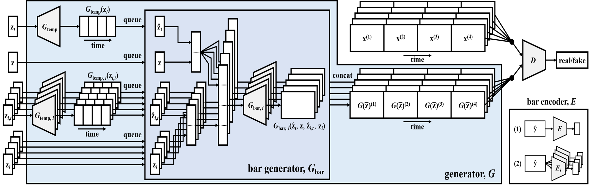

# Music_Generation-using-musegan
Music generation is achieved using Generative Adversarial Networks (GANs), specifically the MuseGAN model, which is designed to generate music that corresponds to the identified emotions. The mood configurations have been defined in the generation module so as to change the parameters while generating the music, according to the mood as selected by the user. In this case; uplifting, meditation, nature inspired and bittersweet.

MuseGAN is a generative adversarial network designed for music generation, particularly for creating multi-track compositions. The model includes two main components: the generator and the discriminator. The generator is built with both a multitrack model and a temporal model. The multitrack model allows the generator to produce multiple musical tracks simultaneously, such as drums, bass, and melody, while the temporal model ensures that the generated music maintains a coherent time structure, preserving rhythms and timing. 

The input to the generator can include random noise vectors or structured latent representations, such as predefined mood configurations. 

The discriminator evaluates the generated music by distinguishing between real and fake tracks, guiding the generator to improve. 

The output of the generator is typically in the form of MIDI files, which correspond to different music categories (e.g., meditation, uplifting, nature-inspired, or bittersweet) based on the mood configurations. 
These outputs can be visualized through tools like piano rolls and time-vs-pitch graphs.

